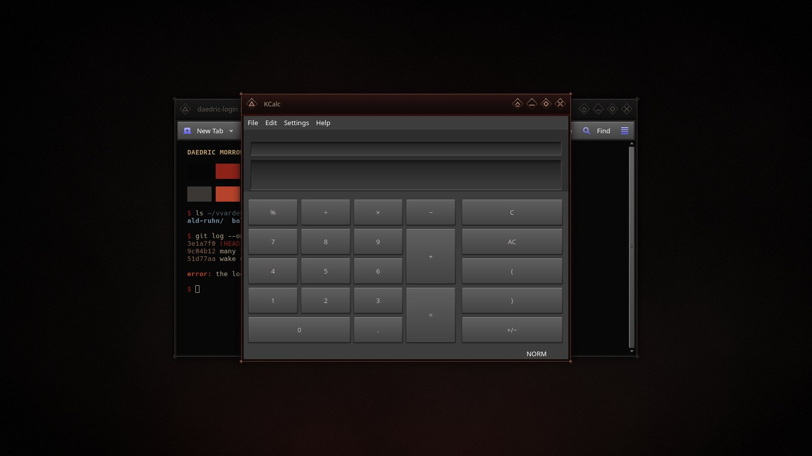
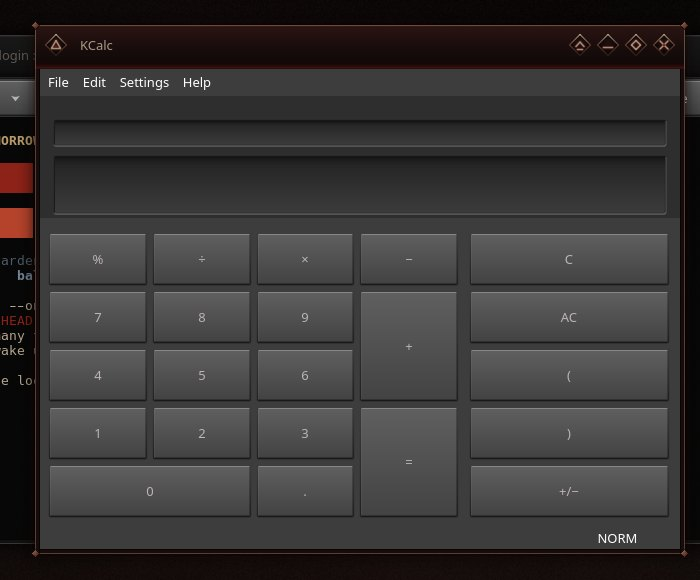
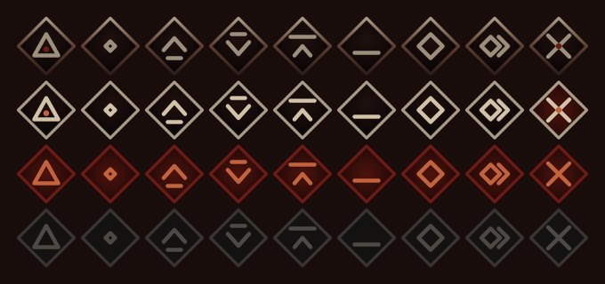

# Daedric Morrowind — Aurorae Window Decoration

An Aurorae theme for KWin on Plasma 6, in dark reds, browns and ash greys.

## What you get

- **Title bar:** near-black oxblood stone with a faint dark-red seam along its bottom
  edge. Inactive windows turn cold ash grey, so focus is obvious.
- **Frame:** thin bronze hairlines, a diamond stud on each corner, and a soft drop
  shadow.
- **Buttons:** open diamonds with rounded glyphs that glow softly; the rim brightens
  on hover and close fills blood red. State changes cross-fade.
- **Maximized windows:** the same bar and seam, without the frame.

Button states, top to bottom: normal, hover, pressed, inactive.

## Requirements

KWin on Plasma 6 (Aurorae).

## Install

    git clone https://github.com/numbpill3d/daedric-morrowind-aurorae
    cd daedric-morrowind-aurorae
    ./install.sh

Then choose **DaedricMorrowind** in System Settings › Colors & Themes › Window Decorations.

## Changing colours or sizes

Every file here is generated by `build-decoration.py`. The palette and the geometry
(shadow, border, title height, button size) are constants at the top:

    python3 build-decoration.py ~/.local/share/aurorae/themes/DaedricMorrowind

KWin does not reload a theme of the same name on its own: switch to another
decoration and back to see changes.

## The rest of the suite

| piece | repo |
|---|---|
| SDDM login | [daedric-morrowind-sddm](https://github.com/numbpill3d/daedric-morrowind-sddm) |
| Plymouth boot splash | [daedric-morrowind-plymouth](https://github.com/numbpill3d/daedric-morrowind-plymouth) |
| Plasma splash screen | [daedric-morrowind-splash](https://github.com/numbpill3d/daedric-morrowind-splash) |
| Lock screen wallpaper | [daedric-morrowind-lockscreen](https://github.com/numbpill3d/daedric-morrowind-lockscreen) |
| Window decoration | [daedric-morrowind-aurorae](https://github.com/numbpill3d/daedric-morrowind-aurorae) |
| Konsole + kitty colours | [daedric-morrowind-konsole](https://github.com/numbpill3d/daedric-morrowind-konsole) |

## Credits and licence

By splicer scorn (voidrane). GPL-3.0-or-later.

Unofficial fan work. The Elder Scrolls and Morrowind are trademarks of their
owner; a few short in-world phrases are quoted as inscriptions.
